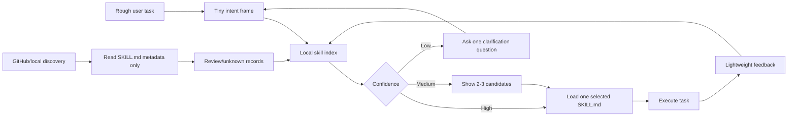

# Skill Router Registry

> A tiny routing layer for Codex skills: turn a rough task into the right skill choice without loading the whole skill library.

[中文说明](README.zh-CN.md) | MIT License

Skill Router Registry is for teams and power users who are starting to accumulate many Codex skills. It keeps a compact local index, ranks candidate skills from metadata, emits a small route decision, and only then loads the selected skill.

```text
rough user task
-> tiny intent frame
-> compact skill metadata search
-> selected skill
-> execution
-> feedback updates routing preference
```

## Architecture



## Why It Exists

Large skill collections create a new problem: the agent can waste context deciding what to read. This skill treats routing as a first-class step.

- **Token-light by default**: route from metadata before reading full `SKILL.md` files.
- **One top-level entry point**: users can speak naturally; the router chooses the workflow.
- **Safe discovery**: GitHub skills are indexed as review records, not installed or executed.
- **Extensible**: local skills, cloned repos, and approved GitHub repos can all become routing metadata.
- **Feedback-aware**: routing can be calibrated from user feedback without pretending to have permanent memory.

## Quickstart

Build an index from installed local skills:

```powershell
python .\skill-router-registry\scripts\build_local_index.py --skills-dir "$env:USERPROFILE\.codex\skills" --out skill-index.json
```

Route a task:

```powershell
python .\skill-router-registry\scripts\search_skill_index.py "make an explainer video with subtitles" --index skill-index.json
```

Output:

```text
Route:
- Task type: video
- Best skill: seedance-2-pro-video
- Why: matched video, subtitle; trust=trusted; risk=review
- Confidence: high
- Next action: load only seedance-2-pro-video and execute the task
```

Get JSON for automation:

```powershell
python .\skill-router-registry\scripts\search_skill_index.py "review this MATLAB control code" --index skill-index.json --format json
```

## Install

Copy the skill folder into your Codex skills directory:

```powershell
Copy-Item -LiteralPath .\skill-router-registry -Destination "$env:USERPROFILE\.codex\skills\skill-router-registry" -Recurse -Force
```

Restart or refresh Codex.

## GitHub Discovery

Discovery only reads `SKILL.md` metadata. It does not install skills, execute code, or mark community skills as trusted.

Scan a user-approved repository:

```powershell
python .\skill-router-registry\scripts\discover_skill_metadata.py --repo https://github.com/openai/skills --out skill-index.review.json
```

Scan a local checkout:

```powershell
python .\skill-router-registry\scripts\discover_skill_metadata.py --path .\some-skills-repo --out skill-index.review.json
```

Merge with an existing index:

```powershell
python .\skill-router-registry\scripts\discover_skill_metadata.py --path .\some-skills-repo --merge-index skill-index.json --out skill-index.review.json
```

## Safety Model

The registry is a routing index, not a trust guarantee.

- `trusted`: local installed skill, official source, or user-approved source.
- `review`: known source or changed skill that still needs inspection.
- `unknown`: discovered but not reviewed.

Risk is flagged when a skill mentions shell commands, package installation, network access, auth files, tokens, downloads, or executable code.

## Project Layout

```text
skill-router-registry/
  SKILL.md
  agents/openai.yaml
  scripts/
    build_local_index.py
    search_skill_index.py
    discover_skill_metadata.py
    eval_routes.py
    check_registry_rules.py
  references/
    registry-schema.md
    routing-policy.md
    github-discovery.md
examples/
  sample-index.json
  queries.md
  sample-routes.md
benchmarks/
  routes.jsonl
```

## Design Principles

- Load zero or one full skill by default.
- Ask one clarification question when confidence is low.
- Prefer a small wrong-correction loop over a large reasoning dump.
- Never auto-install or auto-run community skills.
- Keep the runtime skill compact; put public docs outside the skill folder.

## Validation

```powershell
python .\skill-router-registry\scripts\check_registry_rules.py
python .\skill-router-registry\scripts\eval_routes.py --index .\examples\sample-index.json
python .\skill-router-registry\scripts\eval_routes.py --index .\examples\sample-index.json --cases .\benchmarks\routes.jsonl
python "$env:USERPROFILE\.codex\skills\.system\skill-creator\scripts\quick_validate.py" .\skill-router-registry
```

## Benchmark

The benchmark is a JSONL file where each line is one real user-style request:

```json
{"id":"prompt-001","query":"把我的大白话问题转成一个更清晰的提示词","expected_task_type":"planning","expected_best_skill":"question-to-prompt-pack","min_confidence":"high"}
```

Add cases to [benchmarks/routes.jsonl](benchmarks/routes.jsonl). A good case should be short, realistic, and tied to an expected route. Prefer 30-50 cases over a giant synthetic dataset.

## Roadmap

- Curated public registry feeds with signed review metadata.
- Daily/weekly discovery automation.
- Route evaluation benchmark with expected skill choices.
- Personal routing preference file with explicit user opt-in.
- UI panel for candidate comparison and one-click feedback.

## Contributing

See [CONTRIBUTING.md](CONTRIBUTING.md). Good contributions improve routing quality, safety review, docs, or examples without increasing runtime token load.

## License

MIT.
