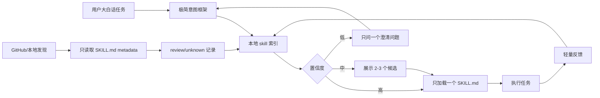

# Skill Router Registry

> 一个面向 Codex Skills 的轻量路由层：把用户的大白话任务，低 token 地匹配到最合适的 skill。

[English README](README.md) | MIT License

当 skills 越来越多时，新的问题不是“有没有能力”，而是“应该加载哪个能力”。Skill Router Registry 把“路由”变成一个明确步骤：先查紧凑 metadata，再选择 skill，最后只加载被选中的 `SKILL.md`。

```text
用户大白话问题
-> 极简意图框架
-> skill metadata 检索
-> 选择对应 skill
-> 执行任务
-> 反馈结果回到用户偏好/路由策略
```

## 架构



## 核心价值

- **默认省 token**：先从 metadata 路由，不把整个 skill 库塞进上下文。
- **一个顶层入口**：用户自然表达任务，router 负责选择工作流。
- **安全发现**：GitHub skills 只生成待审查 metadata，不自动安装、不执行。
- **易扩展**：本地 skills、克隆仓库、用户批准的 GitHub 仓库都能进入索引。
- **可校准**：通过用户反馈修正路由偏好，但不假装拥有永久记忆。

## 快速开始

从本地已安装 skills 构建索引：

```powershell
python .\skill-router-registry\scripts\build_local_index.py --skills-dir "$env:USERPROFILE\.codex\skills" --out skill-index.json
```

路由一个任务：

```powershell
python .\skill-router-registry\scripts\search_skill_index.py "make an explainer video with subtitles" --index skill-index.json
```

输出示例：

```text
Route:
- Task type: video
- Best skill: seedance-2-pro-video
- Why: matched video, subtitle; trust=trusted; risk=review
- Confidence: high
- Next action: load only seedance-2-pro-video and execute the task
```

给自动化系统使用 JSON 输出：

```powershell
python .\skill-router-registry\scripts\search_skill_index.py "review this MATLAB control code" --index skill-index.json --format json
```

## 安装

复制 skill 文件夹到 Codex skills 目录：

```powershell
Copy-Item -LiteralPath .\skill-router-registry -Destination "$env:USERPROFILE\.codex\skills\skill-router-registry" -Recurse -Force
```

然后重启或刷新 Codex。

## GitHub 发现

发现流程只读取 `SKILL.md` metadata。它不会安装 skill，不会执行代码，也不会把社区 skill 自动标记为可信。

扫描用户批准的 GitHub 仓库：

```powershell
python .\skill-router-registry\scripts\discover_skill_metadata.py --repo https://github.com/openai/skills --out skill-index.review.json
```

扫描本地克隆目录：

```powershell
python .\skill-router-registry\scripts\discover_skill_metadata.py --path .\some-skills-repo --out skill-index.review.json
```

合并到已有索引：

```powershell
python .\skill-router-registry\scripts\discover_skill_metadata.py --path .\some-skills-repo --merge-index skill-index.json --out skill-index.review.json
```

## 安全模型

registry 是路由索引，不是安全背书。

- `trusted`：本地已安装、官方来源、或用户明确批准的来源。
- `review`：已知来源或发生变更的 skill，需要检查。
- `unknown`：发现但未审查。

如果 skill 提到 shell 命令、安装依赖、网络访问、认证文件、token、下载或执行远程代码，会被标记为需要审查。

## 项目结构

```text
skill-router-registry/
  SKILL.md
  agents/openai.yaml
  scripts/
    build_local_index.py
    search_skill_index.py
    discover_skill_metadata.py
    eval_routes.py
    check_registry_rules.py
  references/
    registry-schema.md
    routing-policy.md
    github-discovery.md
examples/
  sample-index.json
  queries.md
  sample-routes.md
benchmarks/
  routes.jsonl
```

## 设计原则

- 默认最多加载一个完整 skill。
- 置信度低时只问一个澄清问题。
- 用小反馈回路纠偏，不输出大段推理。
- 不自动安装或执行社区 skill。
- 运行时 skill 保持紧凑，面向用户的开源文档放在 skill 文件夹外。

## 验证

```powershell
python .\skill-router-registry\scripts\check_registry_rules.py
python .\skill-router-registry\scripts\eval_routes.py --index .\examples\sample-index.json
python .\skill-router-registry\scripts\eval_routes.py --index .\examples\sample-index.json --cases .\benchmarks\routes.jsonl
python "$env:USERPROFILE\.codex\skills\.system\skill-creator\scripts\quick_validate.py" .\skill-router-registry
```

## Benchmark

benchmark 使用 JSONL：每一行是一条真实用户风格的问题。

```json
{"id":"prompt-001","query":"把我的大白话问题转成一个更清晰的提示词","expected_task_type":"planning","expected_best_skill":"question-to-prompt-pack","min_confidence":"high"}
```

继续往 [benchmarks/routes.jsonl](benchmarks/routes.jsonl) 追加即可。好的 case 应该短、真实、有明确期望路由。优先积累 30-50 条高质量真实问题，不要追求巨大的合成数据集。

## Roadmap

- 带签名审查 metadata 的公共 registry feeds。
- 每日/每周发现自动化。
- 路由评测集：给定任务，检查是否选对 skill。
- 用户显式同意后启用个人路由偏好文件。
- 候选 skill 对比与一键反馈 UI。

## 贡献

见 [CONTRIBUTING.md](CONTRIBUTING.md)。好的贡献应提升路由质量、安全审查、文档或示例，同时不增加运行时 token 负担。

## 许可证

MIT。
